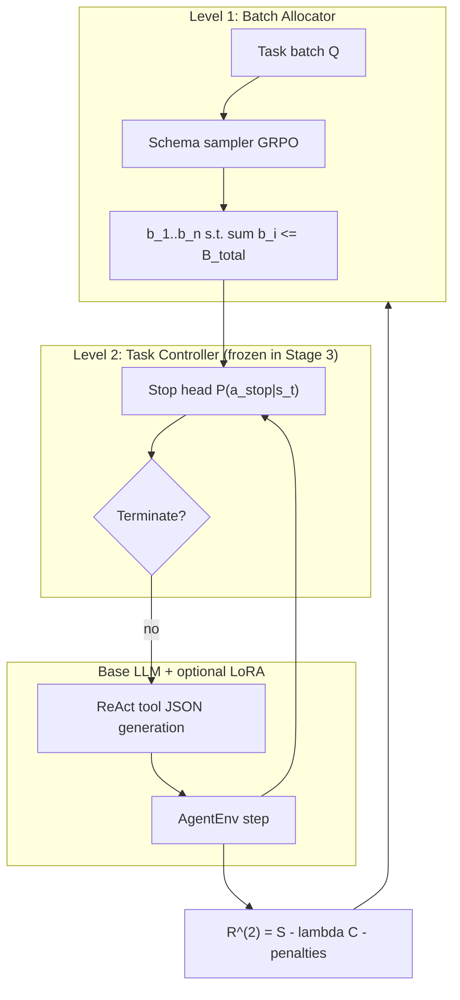

# HBAC Methodology

**Context store** for the technical core of Hierarchical Budgeted Agent Controller (HBAC).  
Companion docs: [Experiments.md](Experiments.md) · [Results.md](Results.md) · [Related Work.md](Related%20Work.md) · [Research Plan.md](Research%20Plan.md)

*Last updated: July 2026*

---

## 1. Problem formulation

> **Paper v2 note:** Level-1 is a contextual bandit over allocation schemas; Level-2 is a stop classifier on frozen ReAct rollouts. This is **not** a jointly trained hierarchical POMDP unless L1, L2, and the LLM are co-trained (we do not).

We model long-horizon LLM agents as a **two-level decoupled control stack** [A12, A9].

### 1.1 Level 1 — Global batch allocator

Given a batch of tasks \(\mathcal{Q} = \{q_1,\ldots,q_n\}\) and global token budget \(B_{\text{total}}\):

$$\{b_1,\ldots,b_n\} = \pi^{(1)}(\mathcal{Q}, B_{\text{total}}), \quad \sum_{i=1}^{n} b_i \le B_{\text{total}}, \quad b_i \ge b_{\min}$$

where \(b_{\min} = \texttt{len}(\mathcal{Q}) \times 40\) tokens in our tight-budget tracks (prevents floor collapse across budget fractions).

### 1.2 Level 2 — Per-task controller

For each task \(q_i\), the Level-2 policy \(\pi^{(2)}\) executes a semi-MDP over turns \(t = 1,\ldots,T_i\):

**State** (partial observability):

$$s_t = (h_t,\; b_i^{\text{rem}},\; T,\; D_t)$$

| Symbol | Meaning |
|--------|---------|
| \(h_t\) | Conversation history (ReAct trace) [A1] |
| \(b_i^{\text{rem}}\) | Remaining per-task token budget |
| \(T\) | Tool registry (benchmark-specific) |
| \(D_t\) | Draft signals: acceptance rate \(\alpha_t\), draft token fraction (H5) [A15, A16] |

**Action** (factored):

$$a_t = (a_{\text{stop}},\; a_{\text{tool}},\; a_{\text{approx}})$$

In the current implementation, Stage 1–3 primarily train \(a_{\text{stop}}\); tool selection follows the frozen LLM ReAct policy; approximate inference routing is planned.

**Termination:** Episode ends when \(a_{\text{stop}} = 1\), budget exhausted, or environment signals success.

---

## 2. Reward structure

### 2.1 Level-2 terminal reward

Implemented in `hbac/training/reward.py`:

$$R^{(2)}_i = S_i - \lambda C_i - \gamma L_i - \delta R_i - \eta \cdot \mathbb{1}[\text{premature stop}]$$

| Term | Definition |
|------|------------|
| \(S_i \in \{0,1\}\) | Task success (verifiable benchmark outcome) |
| \(C_i\) | Total tokens consumed on task \(i\) |
| \(L_i\) | Wall-clock latency (ms) |
| \(R_i\) | Risk / error penalty |
| Premature-stop penalty | Extra cost if agent stops before env success |

**Invariants** (validated by `validate_reward.py` before training):
1. Success at equal tokens beats premature stop.
2. In-budget success beats over-budget success.
3. Token cost is monotonic holding success fixed.

### 2.2 Level-1 batch reward

$$R^{(1)} = \sum_{i=1}^{n} (S_i - \lambda C_i)$$

Sparse batch signal; allocator does not observe step-level actions (standard hierarchical RL [A12]).

### 2.3 Schema-level GRPO reward (Variant B)

For allocation schema \(g \in \{1,\ldots,G\}\):

$$\tilde{R}_g = R^{(1)}_g + \beta \cdot \frac{1}{n}\sum_{i=1}^{n} A_i^{(g)}$$

where \(A_i^{(g)}\) is counterfactual credit (§3.2) and \(\beta = 0.2\) mixing coefficient in `credit_weighted_schema_reward`.

---

## 3. Learning algorithms

### 3.1 Variant A — PPO + utility network (Level 1)

**Level 2:** Monolithic stop head over hand-crafted features \(\phi(s_t) \in \mathbb{R}^d\):

$$\text{stop\_logit}(s_t) = w_2^\top \sigma(W_1 \phi(s_t) + b_1) + b_2$$

$$P(a_{\text{stop}}=1 \mid s_t) = \sigma(\text{stop\_logit}(s_t))$$

Trained with PPO [A10] and KL penalty to frozen reference policy [A11]:

$$\mathcal{L}_{\text{PPO}} = \mathcal{L}_{\text{clip}} + c_{\text{KL}} \cdot D_{\text{KL}}(\pi_{\text{ref}} \| \pi_\theta)$$

**Level 1:** Utility network \(V(q_i, b) = \mathbb{E}[U_i \mid q_i, b]\) predicts per-task utility; allocation via schema sampling + PPO (`train_variant_a_l1.py`).

### 3.2 Variant B — GRPO + counterfactual credit (Level 1)

**Level 2:** Frozen after Stage 1 (oracle replay).

**Level 1:** GRPO [A17] over allocation schemas. For each batch, sample \(G\) schemas, rollout oracle trajectories, compute rewards \(\{R_g\}_{g=1}^G\):

$$\hat{A}_g = \frac{R_g - \mu_R}{\sigma_R + \epsilon}$$

Policy update uses group-relative advantages (no critic), matching TAB's GRPO recipe [A2, A17].

**Counterfactual credit** (COMA-style [A13]):

$$A_i = R_{\text{batch}} - R_{\text{batch}}^{(-i)}$$

where \(R_{\text{batch}}^{(-i)}\) is batch reward with task \(i\) held to uniform allocation. Implemented in `hbac/training/credit.py`.

### 3.3 Feature vector (Level 2)

Base features (7-dim), `featurize_observation`:

$$\phi(s) = \big[1,\; t/100,\; |h|/50,\; \text{chars}(h)/10^4,\; |\text{feedback}|/5000,\; |T|/10,\; b^{\text{rem}}/(b^{\text{rem}}+1)\big]$$

**H5 extension** (9-dim): append draft signals \(\alpha_t\), `draft_token_frac` when `input_dim=9`.

### 3.4 Phase 3b — LLM GRPO / SFT (LoRA)

Frozen hierarchical controller allocates budgets; base LLM (Qwen2.5-7B) generates tool JSON.

**v1 (failed):** Character-overlap reward on flat prompts, 128 samples, no SFT warmstart.

**v2 (current):** Step-level chat records matching live eval system prompts (`grpo_records.py`).

**Tool-aware reward** (`tool_reward.py`):

$$r_{\text{tool}} = w_{\text{json}} \mathbb{1}[\text{valid JSON}] + w_{\text{name}} \mathbb{1}[\hat{a}_{\text{tool}} = a_{\text{tool}}^*] + w_{\text{in}} \cdot \text{sim}(\text{input}) + w_{\text{ov}} \cdot \text{overlap}$$

**Training modes:**
- `sft_only`: LoRA SFT on oracle completions (3 epochs, lr \(2\times10^{-5}\))
- `sft_then_grpo`: SFT warmstart → TRL GRPO (8 groups, \(\beta=0.04\), lr \(10^{-6}\))

---

## 4. Architecture diagram

---

## 5. Curriculum (Stages 1–4)

| Stage | Trains | Frozen |
|-------|--------|--------|
| 1 | \(a_{\text{stop}}\) only | — |
| 2 | \(a_{\text{stop}}\), partial tools | — |
| 3 | Level-1 allocator | Level-2 |
| 4 | Joint fine-tuning | — |

Oracle initialization: strong-model ReAct rollouts → filter successes → SFT / GRPO groups (`collect_oracles.py`, `export_sft.py`).

---

## 6. Implementation map

| Component | Path |
|-----------|------|
| Stop controller | `hbac/training/controller.py` |
| PPO + KL | `hbac/training/ppo.py` |
| Level-1 GRPO | `hbac/training/grpo.py`, `level1.py` |
| Counterfactual credit | `hbac/training/credit.py` |
| Batch curriculum | `hbac/training/batch_curriculum.py` |
| Oracle replay | `hbac/training/oracle_replay.py` |
| Live eval | `hbac/scripts/eval_compose_live.py` |
| LLM GRPO v2 | `hbac/scripts/train_llm_grpo_v2.py` |
| Tool reward | `hbac/training/tool_reward.py` |

---

## 7. Open methodology questions

| ID | Question | Status |
|----|----------|--------|
| M1 | Does COMA credit change L1 under oracle replay? | **No** at 50- and 150-batch scale (H6) |
| M2 | Do draft signals improve stop accuracy? | **No** locally (H5) |
| M3 | Does tool-aligned GRPO LoRA improve live pass@1? | **Testing** (v2 in flight) |
| M4 | TRACE-style capability routing vs single LoRA? | **Candidate** next method |
