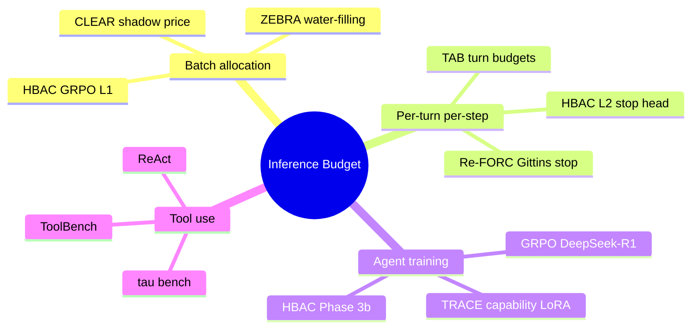

# HBAC Related Work

**Living literature context store.** We continuously survey inference-time budgeting, agent RL, and capability-targeted training. Cross-reference [references.bib](../references.bib) and [Research Plan.md](Research%20Plan.md) §§1–2.

*Last updated: July 4, 2026*

---

## 1. How to use this document

| Action | When |
|--------|------|
| **Add a paper** | New arXiv/preprint relevant to budgeting, stopping, tools, or agent RL |
| **Tag relevance** | L1 alloc, L2 stop, tool use, draft routing, training method |
| **Note HBAC delta** | What they optimize vs what HBAC adds |
| **Link experiment** | If we implement or baseline their method |

**Research queue (July 2026):**
- [ ] TRACE capability-targeted LoRAs — [arXiv:2604.05336](https://arxiv.org/abs/2604.05336)
- [ ] DPO / IPO for tool-JSON preference learning
- [ ] ROI-Reasoning, HBPO, TALE (cited in ZEBRA related work)
- [ ] AdaCompute test-time compute routing — [A14]

---

## 2. Landscape map

---

## 3. Core baselines (implemented or proxied in HBAC)

### 3.1 ReAct — Reasoning + Acting [A1]

| | |
|---|---|
| **Citation** | Yao et al., ICLR 2023 |
| **Optimizes** | Interleaved thought / action / observation traces |
| **Budget scope** | None — fixed generation limits externally |
| **HBAC relation** | Level-2 action space includes ReAct-style tool JSON; HBAC adds learned stopping and global batch allocation on top |

**HBAC improvement:** ReAct does not learn when to stop or how to split a batch budget. HBAC wraps ReAct rollouts with \(a_{\text{stop}}\) and L1 allocator \(\pi^{(1)}\).

---

### 3.2 TAB — Turn-Adaptive Budgets [A2]

| | |
|---|---|
| **Citation** | Jali et al., arXiv:2604.05164 (2026) |
| **Optimizes** | Per-turn token budget in multi-turn math reasoning via GRPO-trained budgeter |
| **Budget scope** | Per-problem global constraint; **not** cross-query batch allocation |
| **Reported gains** | Up to 35% token savings at matched accuracy; 40% with All-SubQ variant |

**Key equation (reward scalarization):**

$$r = \alpha \cdot \text{accuracy} + (1-\alpha) \cdot \text{budget adherence}$$

**HBAC delta:**

| Dimension | TAB | HBAC |
|-----------|-----|------|
| Allocation unit | Turn within one problem | Task within batch + turn within task |
| Training | GRPO budgeter only | Hierarchical: L2 PPO stop + L1 GRPO schema |
| Domains | Math reasoning | SWE + LCB + ToolBench + τ-bench |
| Stopping | Implicit via budget exhaustion | Explicit \(a_{\text{stop}}\) + forecaster (planned Re-FORC) |

**Our baseline:** Heuristic TAB proxy in `hbac/baselines/tab.py` — not paper checkpoint.

---

### 3.3 Re-FORC — Adaptive Reward Prediction [A3]

| | |
|---|---|
| **Citation** | Zabounidis et al., NeurIPS 2025, arXiv:2511.02130 |
| **Optimizes** | Early stopping via Gittins index on predicted future reward \(\psi(t \mid x, z, \pi)\) |
| **Budget scope** | Per-chain; no global batch budget |
| **Reported gains** | 26% compute savings (early stop); +4% acc at equal compute (model routing) |

**Theoretical basis:** Pandora's box / Weitzman index [A24] — reservation value for continuing reasoning.

**HBAC delta:** Re-FORC addresses *when* to stop one chain; HBAC additionally learns *how much budget each task in a batch deserves* (Level 1). Planned integration: Re-FORC forecaster as feature in L2 state or replacement for hand-crafted stop head.

**Our baseline:** Heuristic proxy in `hbac/baselines/reforc.py`.

---

### 3.4 CLEAR — Shadow Price Allocation [A4]

| | |
|---|---|
| **Citation** | Wan et al., arXiv:2606.03092 (2026) |
| **Optimizes** | Global token budget across independent queries via economic equilibrium |
| **Mechanism** | Shifted-surge utility curves → bisection for shadow price \(\lambda^*\) → Lambert W closed-form per-query limits |
| **Reported gains** | Up to 3× global accuracy vs uniform in resource-scarce regimes |

**Three-step pipeline:**
1. Threshold modeling (emergence per query)
2. Price discovery (bisection on \(\lambda\))
3. Optimal allocation (Lambert W policy)

**HBAC delta:**

| Dimension | CLEAR | HBAC |
|-----------|-------|------|
| Training | Zero-shot inference wrapper | RL-trained L1 (GRPO + schemas) |
| Utility model | Analytic surge curves | Learned from oracle rollouts |
| Stopping | Truncation / abandonment | Learned \(a_{\text{stop}}\) + tool actions |
| Our H4 result | Ties uniform (60%) | **80% pass@1** at 40–50% budget |

**Why CLEAR underperforms in our setting:** Stub/oracle replay lacks per-query emergence curves CLEAR expects; surge parameters tuned for math reasoning tasks. Implementation: `hbac/baselines/clear.py`.

---

### 3.5 ZEBRA — Zero-shot Budgeted Resource Allocation [A5]

| | |
|---|---|
| **Citation** | Hamri et al., arXiv:2605.20485 (2026) |
| **Optimizes** | Multi-phase pipeline budget via LLM-estimated utility curves + water-filling knapsack |
| **Budget scope** | Orchestration-side; **dependent phases** of one pipeline (not independent query batch) |
| **Training** | Zero-shot — no RL fine-tuning |

**HBAC delta:** ZEBRA splits budget across *phases* (plan → code → test); HBAC splits across *parallel tasks* in a serving batch and controls per-task agent trajectories. Complementary, not directly comparable without multi-agent pipeline benchmark.

---

## 4. Agent training and capability methods

### 4.1 GRPO — Group Relative Policy Optimization [A17]

| | |
|---|---|
| **Citation** | Shao et al., 2024 (DeepSeek-R1 line) |
| **Used in HBAC** | L1 schema training (Variant B); Phase 3b LLM LoRA |
| **Advantage** | Critic-free; normalizes rewards within sampled groups |

$$\hat{A}_g = \frac{R_g - \mu_R}{\sigma_R + \epsilon}$$

Also used by TAB [A2] and TRACE [kang2026trace].

---

### 4.2 TRACE — Capability-Targeted Agentic Training [kang2026trace]

| | |
|---|---|
| **Citation** | Kang et al., arXiv:2604.05336 (2026); [GitHub](https://github.com/ScalingIntelligence/TRACE) |
| **Optimizes** | Environment-specific capability deficits via synthetic targeted envs |
| **Pipeline** | Contrast success/fail trajectories → identify capabilities → synthesize envs → per-capability LoRA via GRPO → route at inference |
| **Reported gains** | +14.1 pts on τ²-Bench; +7 perfect scores on ToolSandBox |

**Why relevant to HBAC Phase 3b failure:** Our GRPO v1 regressed pass@1 because reward was not aligned with the *capability* of valid tool-JSON generation. TRACE-style decomposition is the leading alternative if GRPO v2 remains flat.

**HBAC integration plan:**
1. Run base agent on stub benchmarks
2. Contrast trajectories → capability = "valid tool JSON + correct tool name"
3. Synthesize mini-envs preserving τ-bench/ToolBench schemas
4. Train capability LoRA; route when allocator assigns tool-heavy budget

---

### 4.3 PPO + KL (InstructGPT lineage) [A10, A11]

HBAC Variant A uses PPO with KL penalty to reference policy for L2 stop head. Validated by H7 ablation — no collapse at `kl_coef ∈ {0, 0.01, 0.02, 0.05}`.

---

### 4.4 COMA — Counterfactual Multi-Agent Credit [A13]

HBAC applies COMA-style credit to L1 batch allocation:

$$A_i = R_{\text{batch}} - R_{\text{batch}}^{(-i)}$$

**Empirical finding:** No effect at 150-batch oracle scale (H6). Likely because batch reward is already informative under oracle replay; credit may help with live stochastic rollouts.

---

## 5. Inference compute and drafting

### 5.1 AdaCompute [A14]

Test-time compute allocation across inputs; precursor to CLEAR-style economic framing. HBAC cites for Tier-A fact that non-uniform allocation beats uniform.

### 5.2 Speculative decoding [A15, A16]

Draft model acceptance rate \(\alpha_t\) is an observable runtime signal. HBAC hypothesized (H5) that \(\alpha_t\) helps L2 stopping — **refuted locally** (9-dim features tie 7-dim). May require larger draft–target gap or NetGain-style routing.

---

## 6. Benchmarks (evaluation context)

| Benchmark | Role in HBAC | Key property |
|-----------|--------------|--------------|
| SWE-Bench Verified [A6, A7] | B1 coding agent | 500 human-validated instances |
| LiveCodeBench [A8] | Oracle training + replay | Contamination-free |
| ToolBench [A19] | B3 API orchestration | 16K REST APIs |
| τ-bench [A9] | B4 user interaction | pass^k reliability |
| τ²-bench [A20] | Future target | Dual-control Dec-POMDP |

---

## 7. Comparison matrix (updated July 2026)

| Method | Global batch budget | Per-step stop | Tool routing | Draft signals | RL training | Agent benchmarks |
|--------|:--:|:--:|:--:|:--:|:--:|:--:|
| ReAct [A1] | — | — | heuristic | — | — | partial |
| TAB [A2] | per-problem | budget exhaustion | — | — | GRPO | math |
| Re-FORC [A3] | — | ✓ Gittins | — | — | adapter | math |
| CLEAR [A4] | ✓ | truncation | — | — | — | reasoning |
| ZEBRA [A5] | pipeline phases | — | — | — | zero-shot | APPS/QA |
| TRACE [kang2026trace] | — | — | ✓ capability | — | GRPO LoRA | τ², ToolSandBox |
| **HBAC** | **✓ GRPO L1** | **✓ PPO stop** | **✓ (LLM ReAct)** | **tested (H5−)** | **hierarchical** | **SWE+LCB+Tool+τ** |

---

## 8. Papers to watch (research inbox)

| Paper | arXiv | Relevance | Status |
|-------|-------|-----------|--------|
| TRACE | 2604.05336 | Capability LoRAs for Phase 3b | **Phase 3c DPO submitted** (`16764381`) |
| ROI-Reasoning | Zhao et al. 2026 | Skip low-ROI queries in batch | Read via ZEBRA RW |
| HBPO | Lyu et al. 2025 | Hierarchical budget tiers | Compare to HBAC L1/L2 |
| TALE | Han et al. 2025 | Prompted per-query budget | Zero-shot L1 baseline candidate |
| DPO / IPO | Rafailov et al. | Preference learning for tool JSON | Alternative to GRPO v2 |

---

## 9. Bibliography keys

Full BibTeX in [references.bib](../references.bib). Key entries:

| Key | Work |
|-----|------|
| A1 | ReAct |
| A2 | TAB |
| A3 | Re-FORC |
| A4 | CLEAR |
| A5 | ZEBRA |
| A10 | PPO |
| A11 | InstructGPT / KL |
| A13 | COMA |
| A17 | GRPO |
| A26 | TRACE → `kang2026trace` in bib |

---

## 10. Changelog

| Date | Update |
|------|--------|
| Jul 2026 | Initial context store; CLEAR/TAB/TRACE/Re-FORC/ZEBRA deep dives; H4/H6 empirical deltas |
| — | *Next: add TRACE bib entry; summarize ROI-Reasoning and HBPO after reading* |
