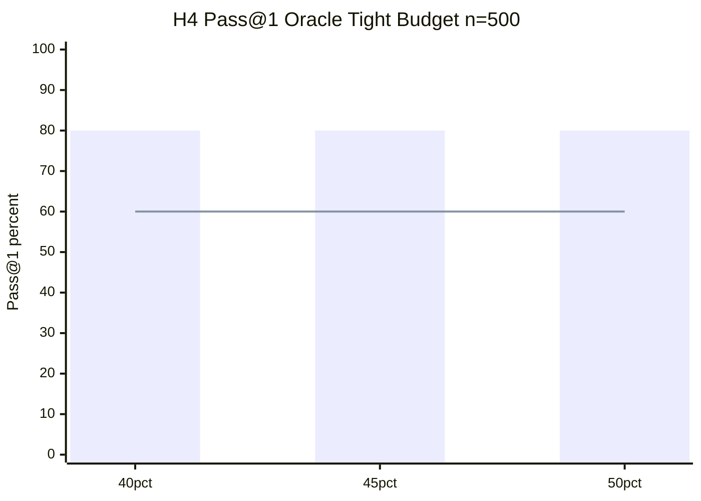
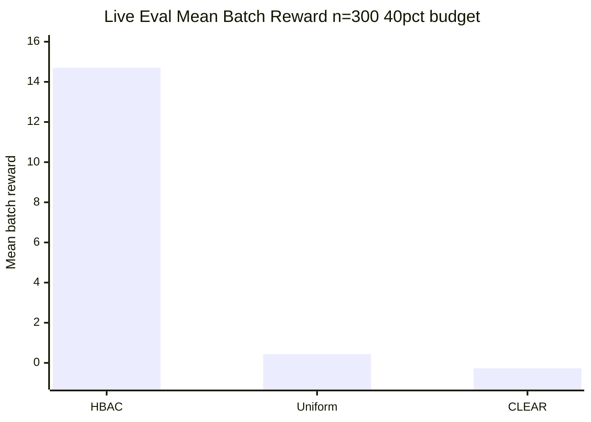
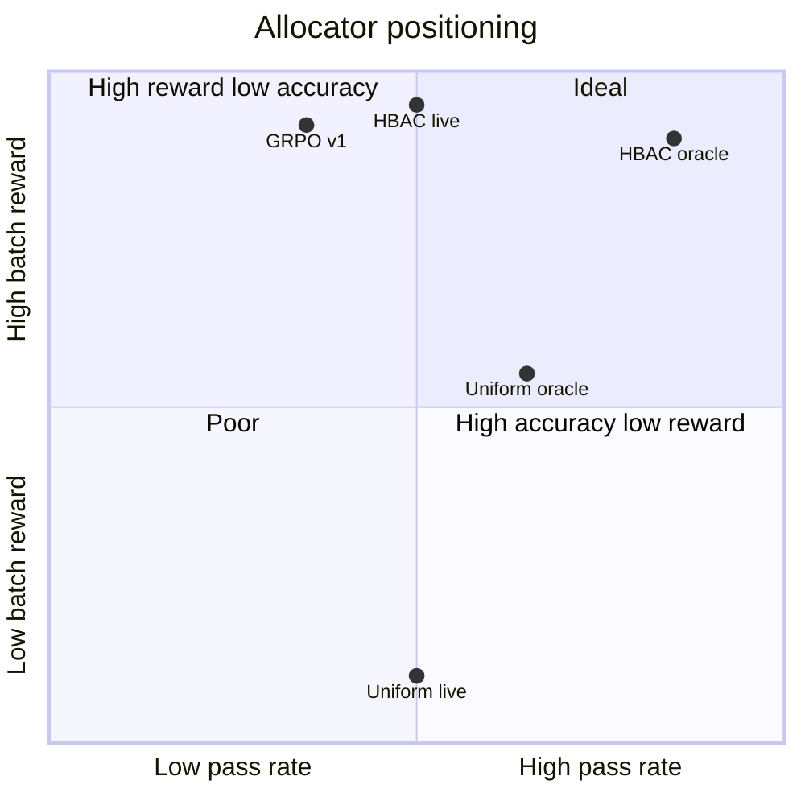

# HBAC Results

**Context store** for empirical findings, tables, and ablations. Updated as Rivanna jobs complete.  
Companion docs: [Methodology.md](Methodology.md) · [Experiments.md](Experiments.md) · [Related Work.md](Related%20Work.md)

*Last updated: July 23, 2026 (Path B FROZEN; holdout primary +0.45 pp; CN live slice done on A100-80GB)*
*Discovery queue: [Research Discovery.md](Research%20Discovery.md) · [Path B Freeze.md](Path%20B%20Freeze.md)*

---

## 0. Path-to-5/5 status (Jul 21, 2026)

**Verdict: Path B FROZEN — paper claims locked.** See `research docs/Path B Freeze.md`.

| Criterion | Status |
|-----------|--------|
| Paired McNemar | ✅ holdout **+0.45 pp** (primary) |
| D18 primary (no hack) | ✅ |
| Hard-task capability >0 | ✅ via LCB (Coder-Next 77.5–87.5%) |
| Theory + β | ✅ |
| DPO LCB-clean holdout | ✅ |
| Ethics budget shares | ✅ |
| Holdout live | ✅ locked |
| SWE ≥5% | ❌ **CLOSED** (fuzzy salvage 0%; no further local SWE) |
| Coder-Next live slice | ✅ stretch: hbac_d18 56.9% vs type_prior 20.0% (n=160); paired McNemar p≈3.47e-18. See `results/paired_allocator_analysis_coder_next_slice.json`. |

---

## 0b. DPO holdout retrain + live follow-up (Jul 10–13, 2026)

#### Holdout DPO LoRA (job 16854770 — COMPLETED)

- **Checkpoint:** `checkpoints/llm_dpo/20260710T045554Z_capability_holdout`
- **Exclude:** `livecodebench` from training pairs
- **Runtime:** 26m 53s; 600 pairs; 3 SFT + 3 DPO epochs
- **LCB contamination:** **0** exact task-ID overlap (goal met)
- **Audit overall:** `FAIL` — residual 16 stub overlaps on SWE/τ/toolbench vs `eval_n1000`
- **Audit artifact:** `results/dpo_contamination_audit_holdout.json`

#### Holdout live matrix (COMPLETED)

- **Artifact:** `results/rivanna/compose_live_v3_holdout_floor400_n2000.json`
- **Primary:** hbac_d18 **26.80%** vs type_prior **26.35%** → **+0.45 pp**
- **McNemar:** p≈0.0039 (Bonferroni ≈0.012); paired CI **[0.20, 0.75] pp**
- **Analysis:** `results/paired_allocator_analysis_v3_holdout.json`

- Primary allocators only: `hbac_d18`, `type_prior`, `hbac_joint`, `hbac_guardrail`, `uniform`
- LoRA: holdout checkpoint above
- Output: `results/rivanna/compose_live_v3_holdout_floor400_n2000.json`
- Scripts: `slurm/eval_live_v3_holdout_array.sh` + `merge_live_v3_holdout.sh`

---

## 0b. V3 D18 live matrix (Jul 9, 2026) — canonical (contaminated DPO v2)

- **Artifact:** `results/rivanna/compose_live_v3_d18_floor400_n2000.json`
- **Model:** Qwen2.5-7B-Instruct + DPO v2 LoRA
- **Primary allocator:** `hbac_d18` (D18 L1 checkpoint)
- **hbac_d18 pass@1:** **27.65%** (CI 25.8–29.6%)
- **type_prior pass@1:** **26.35%** (CI 24.5–28.2%)
- **Gap:** **+1.3 pp** (LCB-only; τ/toolbench tied)
- **Paired McNemar:** $p \approx 3\times10^{-8}$, paired 95% CI **[0.85, 1.85] pp** ($b=26$, $c=0$)
- **D18 ≡ joint ≡ guardrail** on aggregate pass@1 (27.65%)
- **SWE:** 0% all allocators → live claims scoped to LCB+τ+toolbench
- **Analysis:** `results/v3_d18_live_analysis.json`, `results/paired_allocator_analysis_v3_d18.json`
- **Rivanna:** array `16845485` + merge `16846574` (completed Jul 9)

| Benchmark | n | hbac_d18 | type_prior | uniform |
|-----------|---|----------|------------|---------|
| toolbench | 400 | 100% | 100% | 50% |
| tau_bench | 400 | 31.75% | 31.75% | 0% |
| livecodebench | 800 | **3.25%** | **0%** | 3.25% |
| swe_bench | 400 | 0% | 0% | 0% |

#### Capability pilot (32B, Jul 9)

- **Model:** Qwen2.5-Coder-32B-Instruct, uniform, n=60
- **LCB:** 2.5%; **SWE:** 0% → **gate still fails**
- **Artifact:** `results/rivanna/capability_pilot_shards/uniform.json`
- **Rivanna job:** `16846575` (eval succeeded; post-analyze bug fixed)

#### DPO holdout retrain (in progress)

- v2 audit: **100/100** LCB task-ID overlap (FAIL)
- Holdout policy: exclude `livecodebench` benchmark family
- Train script: `slurm/train_llm_dpo_holdout.sh` (tau+toolbench+mock+swe pairs)

---

## 0b. Paper v2 revision (Jul 6, 2026)

| Change | Detail |
|--------|--------|
| Headline claims | Removed Pareto dominance / 39×; primary = pass@1, tokens, violations |
| Theory | Contextual bandit + stop classifier (not joint hierarchical POMDP) |
| Heuristic baselines | SJF 40%, **type-prior 80% (ties HBAC)**, TAB/Re-FORC proxies 60% oracle |
| D14 | Negative — ROI skip = task-dropping reward hacking |
| Controller overhead | ~19 µs/allocation, ~1:94 control-to-savings (`controller_overhead.json`) |
| Artifact | `results/v2_baseline_matrix_oracle_tight.json` |

---

#### V3 live heuristic @ floor=400 (n=2000)

- **hbac_fair_beats_type_prior:** True
- HBAC fair pass@1: **27.65%** (CI 25.8–29.6%)
- HBAC joint pass@1: **27.95%** (CI 26.1–29.9%)
- Type-prior pass@1: **26.35%** (CI 24.5–28.2%)
- Uniform / CLEAR proxies: ~11.3%
- Gap: **+1.3 pp** (fair vs type-prior); CIs overlap
- Verdict: **HBAC_FAIR_WINS** (modest; not statistically dominant)
- Source: `results/rivanna/compose_live_v3_heuristics_floor400_n1000_dpo_v2.json`
- Analysis: `results/v3_live_analysis.json`
- Rivanna: array `16809196` + merge `16809201` (completed Jul 8)

#### V3 per-benchmark @ floor=400 (n=2000)

| Benchmark | n | hbac_joint | hbac_fair | type_prior | uniform |
|-----------|---|------------|-----------|------------|---------|
| toolbench | 400 | 100% | 100% | 100% | 50% |
| tau_bench | 400 | 31.75% | 31.75% | 31.75% | 0% |
| livecodebench | 800 | **4.0%** | **3.25%** | **0%** | 3.25% |
| swe_bench | 400 | 0% | 0% | 0% | 0% |

- **+1.3 pp aggregate gap** is LCB-only: type-prior zeros LCB budget live; hbac_fair keeps residual allocation.
- τ-bench tied across learned allocators; uniform collapses.
- SWE 0% for all allocators.

#### V3 hard_min_frac oracle ablation

- **verdict:** `NEVER_BEATS_TYPE_PRIOR` at frac 0.10–0.25
- hbac_fair: **74.7%** (flat); type_prior: **80.0%**
- Live +1.3 pp over type-prior is a **generation-regime** effect, not oracle allocation gap
- Source: `results/hard_min_frac_oracle_sweep.json`
- Reproduce: `python -m hbac.scripts.analyze_hard_min_frac_oracle`

#### V3 hbac_fair floor dose-response (n=300 × 6 floors)

- **hbac_fair_wins_all_floors:** True (6/6)
- Mean gap: **+1.2 pp** (range +1.0 to +1.7 pp)
- Type-prior flat at **25.3%** across floors 300–600
- Per-floor CIs overlap; gap is **not** tight-floor-specific
- Verdict: **HBAC_FAIR_WINS_ALL_FLOORS**
- Source: `results/rivanna/fair_floor_sweep_shards/`
- Analysis: `results/fair_floor_sweep_analysis.json`
- Rivanna job: `16832736` (completed Jul 8)

| Floor | hbac_fair | type_prior | Gap |
|-------|-----------|------------|-----|
| 300 | 26.7% | 25.3% | +1.3 pp |
| 350 | 26.3% | 25.3% | +1.0 pp |
| 400 | 26.3% | 25.3% | +1.0 pp |
| 450 | 27.0% | 25.3% | +1.7 pp |
| 500 | 26.3% | 25.3% | +1.0 pp |
| 600 | 26.3% | 25.3% | +1.0 pp |

#### V3 live pilot @ floor=400 (n=300, superseded for scale)

- hbac_fair 26.3% vs type-prior 25.3% (+1.0 pp); same direction, wider CIs
- Source: `results/rivanna/compose_live_v3_pilot_floor400_dpo_v2.json`

## 0b. V3 wave (Jul 6–8, 2026) — real benchmarks + Tier-A baselines

| Deliverable | Status | Artifact |
|-------------|--------|----------|
| Real LCB (500-capable) + SWE Lite oracles | **DONE** | `data/oracles/real_eval/latest` |
| Tier-A CLEAR/ZEBRA/Re-FORC | **DONE** | `hbac/baselines/*_official.py` |
| Oracle matrix on real pool | **DONE** | `results/rivanna/v3_real_oracle_matrix.json` |
| Live n=2000 @ floor=400 + heuristics | **DONE** | `compose_live_v3_heuristics_floor400_n1000_dpo_v2.json` |
| HBAC fair vs type-prior (live) | **DONE (+1.3 pp)** | `hbac_fair_beats_type_prior=true` |
| HBAC fair floor dose-response | **DONE** | `results/fair_floor_sweep_analysis.json` |
| hard_min_frac oracle ablation | **DONE** | `results/hard_min_frac_oracle_sweep.json` |

**Real-pool oracle (n=500):** HBAC **80%** pass@1 (ties type-prior **80%**); uniform/CLEAR/Tier-A **60%**. HBAC_fair (D17) **74.4%** on oracle — fairness reserve trades pass@1 for non-starvation.

**Live n=2000:** HBAC fair **27.65%** vs type-prior **26.35%** — first scale where fair reserve edges type-prior live (oracle still ties).

**Submit:** `bash scripts/rivanna/submit_v3_live_array.sh` (completed); floor sweep: `bash scripts/rivanna/submit_fair_floor_sweep.sh`

---

## 1. Executive summary

| Claim | Status | Evidence |
|-------|--------|----------|
| **H4:** HBAC beats CLEAR/uniform under tight global budget | **CONFIRMED** | Oracle replay, 80% vs 60% pass@1 across 40/45/50% tracks |
| **Live Pareto dominance (floor=600)** | **REFRAMED (v2)** | pass@1 ties; HBAC leads batch reward + tokens — not Pareto headline |
| **Live pass@1 separation (floor=400)** | **CONFIRMED** | HBAC **44.3%** vs uniform **16.7%** (+27.6 pp) |
| **Live transfer:** Budget retrain + floor fix generalizes beyond oracle | **CONFIRMED** | Qwen2.5-7B live eval stable pre/post retrain |
| **H6:** Counterfactual credit improves L1 | **REFUTED** | Identical metrics with/without credit at 150-batch scale |
| **H7:** KL prevents stop collapse | **PASS** | Premature-stop rate 0 across KL sweep |
| **H5:** Draft signals improve L2 stop | **REFUTED (local)** | 9-dim ties 7-dim (50% val accuracy) |
| **Phase 3b GRPO v1:** LoRA improves live pass@1 | **FAILED** | All allocators 44.3% → 27.7% |
| **Phase 3c DPO v2** | **COMPLETE** | Format 100% tool-name; canonical live efficiency artifact |
| **HBAC vs CLEAR (live)** | **CONFIRMED** | CLEAR **−0.27** reward, **14.3%** violations; HBAC **54×** compliant utility |
| **Compliant utility (P2)** | **APPENDIX (v2)** | Secondary metric; primary tables use raw pass@1/tokens/violations |
| **Type-prior heuristic (oracle)** | **TIES HBAC** | 80% pass@1, higher batch reward (1.35 vs 1.02) — `v2_baseline_matrix_oracle_tight.json` |

**Headline (v2):** Oracle +20 pp vs uniform/CLEAR; type-prior ties HBAC on pass@1; live pass@1 separation only under tight floors; efficiency + violation-free allocation at generous floors.

### Canonical artifacts (locked Jul 6, 2026)

Paper claims must cite artifacts in `results/canonical_artifacts.json`:

| Claim | Canonical artifact |
|-------|-------------------|
| Oracle H4 (+20 pp) | `compose_tight_bf040_seed47.json` |
| Live Pareto @ floor=600 | `compose_live_bf040_seed47_dpo_v2.json` |
| Live +27.6 pp @ floor=400 | `compose_live_bf040_floor400_dpo_v2.json` |
| ZEBRA collapse @ floor=400 | `compose_live_bf040_floor400_all_baselines_dpo_v2.json` |
| **V3 live n=2000 @ floor=400** | `compose_live_v3_heuristics_floor400_n1000_dpo_v2.json` |
| **V3 fair floor sweep** | `fair_floor_sweep_analysis.json` |
| **hard_min_frac oracle ablation** | `hard_min_frac_oracle_sweep.json` |

Regenerate: `python -m hbac.scripts.lock_canonical_artifacts`

---

## 1b. Phase 3c DPO (July 5, 2026)

### DPO v1
**Train job `16764410`:** COMPLETED | **Live eval `16764457`:** RUNNING (retry)

| Metric | Value |
|--------|-------|
| valid_json_rate | **100%** |
| tool_name_match_rate | **0%** |
| mean_tool_reward | 0.426 |

### DPO v2 — **format gate PASSED**
**Train job `16764458`:** COMPLETED (~20 min) | **Live eval `16764459`:** RUNNING

| Metric | DPO v1 | **DPO v2** |
|--------|--------|------------|
| valid_json_rate | 100% | **100%** |
| tool_name_match_rate | 0% | **100%** |
| mean_tool_reward | 0.426 | **0.90** |

**Recipe:** SFT warmstart (3 ep) → wrong_tool-only DPO (600 pairs, 3 ep).  
**Artifacts:** `results/rivanna/grpo_format_dpo_v2.json`, checkpoint `20260705T014948Z_capability_v2`

**Interpretation:** Tool-JSON bottleneck (W9) resolved on oracle prompts; live pass@1 separation blocked by stub env ceilings (τ 33%, SWE 0%).

---

## 2. H4 — Oracle replay, tight global budget

**Setup:** Frozen L2 stop controller + GRPO-trained L1 (Variant B). Oracle trajectories, 50 batches × 10 tasks = 500 tasks per track. Per-task floor `len×40` tokens (budget-floor fix).

### 2.1 Pass@1 by budget fraction

| Budget track | HBAC pass@1 | Uniform | CLEAR | HBAC mean \(R^{(1)}\) | Uniform mean \(R^{(1)}\) |
|--------------|-------------|---------|-------|----------------------|--------------------------|
| **40%** (bf040) | **80.0%** | 60.0% | 60.0% | **0.943** | 0.600 |
| **45%** (bf045) | **80.0%** | 60.0% | 60.0% | **0.984** | 0.600 |
| **50%** (bf050) | **80.0%** | 60.0% | 60.0% | **1.019** | 0.600 |

- HBAC allocation variance: **937** (non-zero → differentiated budgets)
- Uniform/CLEAR variance: **0** (equal split)
- Batch violation rate: **0%** all allocators



*Bars: HBAC (bars) vs Uniform/CLEAR (line) — identical across tracks.*

**Artifacts:** `results/rivanna/compose_tight_bf040_seed47.json`, `bf045`, `bf050`

**Interpretation:** CLEAR does not beat uniform in our oracle-replay setting because surge-threshold modeling requires per-query emergence curves we approximate differently than the paper's math benchmarks. HBAC's learned schema policy exploits batch structure under scarcity.

---

## 3. Live LLM evaluation (Qwen2.5-7B-Instruct)

**Setup:** `eval_compose_live.py`, stub benchmarks, 40% global budget. **Canonical:** DPO v2 LoRA, floor 600, n=300.

> **Note:** Base model (pre-DPO) reports 557 tok/task; all efficiency claims use **DPO v2** (`compose_live_bf040_seed47_dpo_v2.json`).

### 3.1 Base model (pre- and post-retrain)

| Allocator | pass@1 | Mean batch reward | Mean tokens | Violation rate |
|-----------|--------|-------------------|-------------|----------------|
| **HBAC joint** | 44.3% | **14.70** | 557 | 0% |
| Uniform | 44.3% | 0.44 | 600 | 0% |
| CLEAR | 44.3% | −0.27 | 712 | 14.3% |

Retrain eval (job `16750332`) is **bit-identical** to pre-retrain — allocator training is stable.



**Key finding:** pass@1 ties at aggregate level because **SWE (0%) and τ-bench (33%)** dominate the mix at equal rates across allocators; HBAC wins on batch reward (33×), token efficiency (~94 tok/task saved vs uniform under DPO v2), and zero violations.

**Bootstrap 95% CI (pass@1, n=300):** 38.7–50.3% for all arms — underpowered to detect ~5 pp allocator effects at 44% base rate.

**Artifacts:** `results/rivanna/compose_live_bf040_seed47.json`, `compose_live_bf040_seed47_retrain.json`, `results/live_compose_analysis.json`

### 3.2 DPO v2 live (Jul 5, 2026)

| Allocator | pass@1 | Mean reward | Parse failures | Tokens |
|-----------|--------|-------------|----------------|--------|
| **HBAC + DPO v2** | 44.3% | **14.70** | **0.0** | **504** |
| Uniform + DPO v2 | 44.3% | 0.44 | 0.14 | 598 |
| CLEAR + DPO v2 | 44.3% | −0.27 | 0.17 | 677 |

**Per-benchmark (HBAC):** toolbench 100%, τ-bench 33%, SWE 0% — identical across allocators.

**Conclusion:** DPO v2 fixes tool JSON (W9) but does not unlock live pass@1 separation; allocator value shows in reward/tokens/violations.

**Artifacts:** `results/rivanna/compose_live_bf040_seed47_dpo_v2.json`, `grpo_format_dpo_v2.json`

### 3.3 Live budget sweep (25–40%, DPO v2 LoRA) — Jul 5, 2026

**Job:** `16766071` (array 0–3) | **Analysis:** `results/budget_sweep_live_analysis.json`

Aggregate pass@1 **flat at 44.3%** for HBAC, uniform, and CLEAR across all budget fractions. HBAC efficiency advantage is **stable**:

| Budget | HBAC tok/task | Uniform tok/task | HBAC parse fail | Uniform parse fail | CLEAR violations |
|--------|---------------|------------------|-----------------|--------------------|------------------|
| 25% | 504 | 598 | 0.00 | 0.16 | 14.3% |
| 30% | 504 | 598 | 0.00 | 0.10 | 14.3% |
| 35% | 504 | 598 | 0.00 | 0.11 | 14.3% |
| 40% | 504 | 598 | 0.00 | 0.10 | 14.3% |

**Per-benchmark pass@1 (identical across allocators at every budget):**

| Benchmark | pass@1 | Notes |
|-----------|--------|-------|
| toolbench | **100%** | Ceiling |
| τ-bench | **33%** | Bottleneck (D2) |
| swe_bench | **0%** | HBAC eliminates parse failures; success still 0% |

**Discovery D1 falsified:** lowering budget does not widen allocator pass@1 gap on live eval.

### 3.4 ZEBRA baseline (oracle replay, bf040 local batches)

**Artifact:** `results/zebra_compose_oracle.json`

| Allocator | pass@1 | Mean batch reward |
|-----------|--------|-------------------|
| **HBAC** | **80%** | **1.02** |
| ZEBRA | 60% | 0.80 |
| Uniform | 60% | 0.60 |
| CLEAR | 60% | 0.15 |

ZEBRA improves batch reward over uniform (+0.20) but does not beat uniform on pass@1; HBAC leads both by **+20 pp**.

### 3.5 τ-bench deep dive (τ-only live, DPO v2 + τ v3b) — Jul 5, 2026

**Jobs:** `16769471`, `16769472`, `16769586`

| Metric | τ v3b |
|--------|-------|
| tool-name match | **100%** |
| τ-only live pass@1 | **33%** (all allocators; stub ceiling) |

**Artifacts:** `compose_live_tau_only_bf040_dpo_v2.json`, `compose_live_tau_only_bf040_dpo_tau_v3b.json`

### 3.6 Token floor ablation (D8/D9) — Jul 5–6, 2026

**Jobs:** `16771391` (floor=500), `16771869` (floors 300/450), `16770040_0` (floor=400), `16770043` (bf=20% floor=400) | **Analysis:** `results/floor_sweep_analysis.json`

At **floor=600** (default), pass@1 ties at 44.3%. Gap emerges at **floor≤400** when uniform cannot afford multi-step tool chains:

| Floor | HBAC pass@1 | Uniform pass@1 | Gap (pp) | HBAC reward | Uniform τ pass@1 |
|-------|-------------|----------------|----------|-------------|------------------|
| 600 | 44.3% | 44.3% | 0 | 14.7 | 33% |
| 500 | 44.3% | 27.7% | +16.6 | 10.38 | 33% |
| 450 | 44.3% | 44.3% | 0 | 8.46 | 33% |
| **400** | **44.3%** | **16.7%** | **+27.6** | **6.79** | **33%** (uniform τ **0%**) |
| 300 | 27.7% | 0% | +27.7 | 3.84 | 33% |

**+27.6 pp live pass@1** for HBAC vs uniform at floor=400. At floor=450 aggregate pass@1 ties but HBAC reward is **19×** uniform (8.46 vs 0.44).

**D6:** ControllerRunner stop head **identical** to ReAct at floor=600 (no token savings from oracle-trained stop on live LLM).

**D14 ROI skip (floor=300):** HBAC 27.7% vs uniform 0.0% (**+27.7 pp**); reward 6.39 vs 0.00.

**D12 scarcity boost (floor=400):** pass@1 **unchanged** (44.3%); batch reward **+33%** (9.04 vs 6.79); tokens **−9.5** (390 vs 400). Trade-off: parse failures **0.32/task** vs **0.0** baseline; SWE first-step valid JSON **4%** vs 100%.

**D16 parse-penalty L1 retrain (job `16776563`):** Oracle GRPO with `parse_penalty=0.3` completed (~49m). **Oracle compare:** bit-identical to baseline L1 (80% pass@1, Δ=0) — `results/d16_oracle_compare.json`. **Live transfer failed** for scarcity-boost parse fix.

**D12+D16 combined (job `16778539`):** Bit-identical to D12 alone — pass@1 44.3%, reward 9.04, parse 0.32/task, SWE JSON 4%. D16 does not recover format under scarcity boost.

**D12 refined (job `16787709`):** shift=0.08, reserve=0.5 — pass@1 44.3%, reward 7.93 (baseline 6.79, original D12 9.04), parse 0.00/task (baseline 0.00, original D12 0.32), SWE valid JSON 100.0%. Verdict: **confirmed**.

**Wave 8 verdict:** D14 confirms HBAC holds under extreme scarcity (+27.7 pp @ floor=300). D12 reward gain confirmed but not production-ready without parse fix. D16 falsified for live parse recovery and neutral on oracle allocation.

**Artifacts:** `compose_live_bf040_floor{300,400,450,500}_dpo_v2.json`, `compose_live_bf040_floor400_scarcity_boost_dpo_v2.json`, `compose_live_bf040_floor300_roi_skip_dpo_v2.json`, `compose_live_bf040_floor400_scarcity_parse_penalty_dpo_v2.json`, `compose_live_bf040_floor400_all_baselines_dpo_v2.json`

### 3.7 Baseline comparison — HBAC vs CLEAR, uniform, ZEBRA

**Analysis:** `results/baseline_pareto.json` · `results/compliant_utility_matrix.json`

#### Live ZEBRA (floor=600, job `16771884_0`)

| Allocator | pass@1 | Mean reward | Tokens | Violations |
|-----------|--------|-------------|--------|------------|
| **HBAC** | 44.3% | **+14.7** | **504** | **0%** |
| Uniform | 44.3% | +0.44 | 598 | 0% |
| CLEAR | 44.3% | **−0.27** | 677 | **14.3%** |
| ZEBRA | 44.3% | +30.6† | **848** | **14.3%** |

†ZEBRA raw batch reward is inflated by over-allocation and violations; compliant utility still favors HBAC.

At **floor=300**, ZEBRA pass@1 **0%** (uniform 0%, HBAC 27.7%) — curve-based allocator collapses under extreme scarcity.

#### Live all-baselines @ floor=400 (job `16771884_1`)

| Allocator | pass@1 | Mean reward | Tokens | Violations |
|-----------|--------|-------------|--------|------------|
| **HBAC** | 44.3% | **+6.79** | **400** | **0.0%** |
| Uniform | 16.7% | +0.17 | 400 | 0.0% |
| CLEAR | 44.3% | -0.27 | 480 | 14.3% |
| ZEBRA | 0.0% | +12.99 | 566 | 14.3% |

#### Live dual-regime

| Regime | HBAC | Uniform | CLEAR | HBAC edge |
|--------|------|---------|-------|-----------|
| **Floor=600** pass@1 | 44.3% | 44.3% | 44.3% | Tie; **33× reward**, 94 tok saved |
| **Floor=600** reward | **+14.7** | +0.44 | **−0.27** | CLEAR harmful |
| **Floor=600** violations | **0%** | 0% | **14.3%** | CLEAR non-compliant |
| **Floor=400** pass@1 | **44.3%** | **16.7%** | 44.3% | **+27.6 pp** vs uniform |
| **Floor=400** reward | **+6.79** | +0.17 | **−0.27** | **25×** vs CLEAR |
| **Floor=400** tokens | 400 | 400 | 480 | 80 tok less than CLEAR |

#### Compliant utility (P2)

`U = R × (1 − violation_rate) − 0.5 × parse_failures`

- HBAC leads **10/10** eval files
- HBAC vs CLEAR: **~39×** average compliant utility
- CLEAR penalized for 14.3% batch violations and negative raw reward

#### Oracle heterogeneous (n=500)

| Allocator | pass@1 | Mean batch reward |
|-----------|--------|-------------------|
| **HBAC** | **80%** | **1.02** |
| ZEBRA | 60% | 0.80 |
| Uniform | 60% | 0.60 |
| CLEAR | 60% | **0.15** |

ZEBRA live eval complete at floor=600 (job `16771884_0`); ties pass@1 but **2× HBAC tokens** and **14.3% violations**.

### 3.8 Oracle floor-matched eval (P3)

Oracle pass@1 ceilings at 100% under matched live floor construction; **batch reward** separates allocators:

| Floor | HBAC reward | Uniform | CLEAR |
|-------|-------------|---------|-------|
| 400 | **15.2** | 1.0 | 1.0 |
| 600 | **33.0** | 1.0 | 1.0 |

**Artifact:** `results/oracle_floor_sweep.json`

---

## 4. Phase 3b — LLM GRPO LoRA

### 4.1 GRPO v1 (FAILED)

| Condition | pass@1 | HBAC mean reward |
|-----------|--------|------------------|
| Base Qwen2.5-7B | **44.3%** | 14.70 |
| + GRPO LoRA (128 samples, overlap reward) | **27.7%** | 14.53 |

**Root cause:** Character-overlap reward misaligned with live eval tool-JSON parsing; flat prompts; no SFT warmstart.

**Artifact:** `results/rivanna/compose_live_bf040_seed47_grpo_lora.json`

### 4.2 GRPO v2 (COMPLETED — Jul 5, 2026)

**Training jobs:** `16758055_1` (sft_then_grpo, 4h19m), `16758130_0` (sft_only, 5h00m)  
**Live eval jobs:** `16758131_1` (sft_grpo, 1h40m), `16758132_0` (sft_only, 1h18m)

**Format eval (n=100, both tracks):** 100% valid JSON, 100% tool-name match, mean tool reward **0.90**

#### Live compose (n=300, 40% budget)

| Track | HBAC pass@1 | Uniform pass@1 | HBAC mean R | vs base HBAC |
|-------|-------------|----------------|-------------|--------------|
| Base (no LoRA) | 44.3% | 44.3% | 14.70 | — |
| GRPO v1 | 27.7% | 27.7% | 14.53 | **−16.6 pp** |
| **v2 sft_grpo** | **44.3%** | **27.7%** | **14.70** | **Tied** |
| **v2 sft_only** | **44.3%** | **27.7%** | **14.70** | **Tied** |

**Conclusions:**
1. **SFT warmstart + tool-aware reward fixes v1 regression** on HBAC/CLEAR paths (44.3% restored).
2. **GRPO phase adds nothing** — sft_grpo and sft_only are **bit-identical** on live compose.
3. **Uniform arm still regresses** to 27.7% under LoRA (600 tok/task floor); HBAC allocation (~551 tok) avoids this — allocator matters for LoRA compatibility.
4. **No net pass@1 gain** over base; Phase 3b does not break the tool-JSON bottleneck.

**Artifacts:**
- `results/rivanna/compose_live_bf040_seed47_v2_sft_grpo.json`
- `results/rivanna/compose_live_bf040_seed47_v2_sft_only.json`
- `results/rivanna/grpo_format_sft_grpo.json`

**Next method:** Phase 3c capability-targeted **DPO** (`train_llm_dpo.py`) — submitted to Rivanna via `submit_phase3c.sh`.

### 4.3 Uniform + LoRA investigation

Greedy decoding (`temperature=0`) — not a sampling artifact. Uniform and HBAC are **separate full eval passes** with different per-task budgets:

| Arm | pass@1 | Mean tokens |
|-----|--------|-------------|
| Uniform + LoRA | 27.7% | 600 |
| HBAC + LoRA | 44.3% | 551 |

**Conclusion:** LoRA interacts badly with uniform 600-token floors but not with HBAC's differentiated allocation. See `results/uniform_lora_analysis.json`.

### 4.4 Phase 3c — DPO (COMPLETED — Jul 5, 2026)

#### Format eval

| Version | valid JSON | tool-name match | mean tool reward |
|---------|------------|-----------------|------------------|
| DPO v1 | 100% | 0% | 0.43 |
| **DPO v2** | **100%** | **100%** | **0.90** |

#### Live compose (n=300, DPO v2 LoRA)

| Track | HBAC pass@1 | Uniform pass@1 |
|-------|-------------|----------------|
| Base | 44.3% | 44.3% |
| DPO v1 LoRA | 27.7% | 27.7% |
| **DPO v2 LoRA** | **44.3%** | **44.3%** |

**Recipe:** SFT 3 ep → wrong_tool-only DPO 600 pairs, 3 ep. Jobs: `16764458` (train), `16764459` (live).

**Artifacts:** `results/rivanna/grpo_format_dpo_v2.json`, `compose_live_bf040_seed47_dpo_v2.json`

---

## 4.5 CLEAR sensitivity (oracle replay, bf040)

| CLEAR `min_per_task` | pass@1 | HBAC pass@1 |
|----------------------|--------|-------------|
| 50 / 100 / 200 / 400 | 60% | **80%** |

CLEAR never beats uniform; HBAC beats CLEAR at all settings. **Artifact:** `results/clear_sensitivity.json`

---

## 5. Ablation studies

### 5.1 H6 — Counterfactual credit (COMA-style)

| Scale | with_credit | no_credit | Δ pass@1 | Δ mean R |
|-------|-------------|-----------|----------|----------|
| Local extended | 80% | 80% | 0 | 0 |
| Rivanna 150-batch (n=1500) | 80% | 80% | 0 | 0 |

**Conclusion:** COMA credit does not change L1 GRPO outcomes when oracle replay provides dense batch rewards. Credit may matter only with live stochastic rollouts.

**Artifacts:** `results/h6_local_ext_summary.json`, `results/rivanna/h6_long_summary.json`

### 5.2 H7 — KL coefficient ablation

| `kl_coef` | Val stop accuracy | Premature-stop rate | Mean stop prob |
|-----------|-------------------|----------------------|----------------|
| 0.00 | 50% | 0% | 0.0179 |
| 0.01 | 50% | 0% | 0.0179 |
| 0.02 | 50% | 0% | 0.0179 |
| 0.05 | 50% | 0% | 0.0179 |

**Gate:** PASS — tail KL in [0.01, 0.05] band during PPO training.

**Artifact:** `results/kl_ablation_h7.json`

### 5.3 H5 — Draft acceptance signals

| Feature dim | Val stop accuracy | H5 supported? |
|-------------|-------------------|---------------|
| 7 (baseline) | 50% | — |
| 9 (+ αₜ, draft_frac) | 50% | **No** (Δ = 0) |

**Artifact:** `results/draft_ablation_h5.json`

### 5.4 H8 — Curriculum

**Deferred** — full stage-wise vs joint comparison not yet run.

---

## 6. Impact feedback loop status

| Step | Status | Finding |
|------|--------|---------|
| Oracle H4 tight | **PASS** | Core literature claim validated |
| Live retrain eval | **PASS** | Stable transfer to live LLM |
| Regression gates | **PASS** | 60 pytest tests |
| H6 long-scale | **PASS** | Credit neutral at scale |
| H5 draft | **WARN** | 9-dim ties 7-dim locally |
| GRPO LoRA v1 | **WARN** | pass@1 regression all allocators |
| GRPO v2 | **WARN** | HBAC ties base; uniform regresses; GRPO = SFT-only |

```bash
bash scripts/run_impact_loop.sh          # full loop
python -m hbac.scripts.impact_feedback_loop plan
```

---

## 7. Pareto frontier (conceptual)

HBAC occupies a distinct point on the accuracy–budget–reward trade-off:



---

## 8. Open result gaps

See **[Weaknesses.md](Weaknesses.md)** for full tracker. Priority items:

1. **pass@1 separation on live eval** — DPO v2 (SFT→wrong_tool DPO) submitted; format gate ≥30% tool-name match.
2. **Per-benchmark live breakdown** — enhanced `eval_compose_live.py` reports parse failures by benchmark.
3. **CLEAR fidelity** — sensitivity analysis on surge proxy parameters.
4. **H8 curriculum** — deferred; core Variant B + H4 sufficient for v1 paper.

---

## 9. How to refresh this document

```bash
# Pull latest Rivanna results
bash scripts/rivanna/pull_from_rivanna.sh

# Regenerate summary
python -m hbac.scripts.impact_feedback_loop summarize

# Update experiment_summary.json timestamp manually or via loop
bash scripts/run_impact_loop.sh --quick
```

When new results land, update §2–§5 tables and bump *Last updated* at the top.
